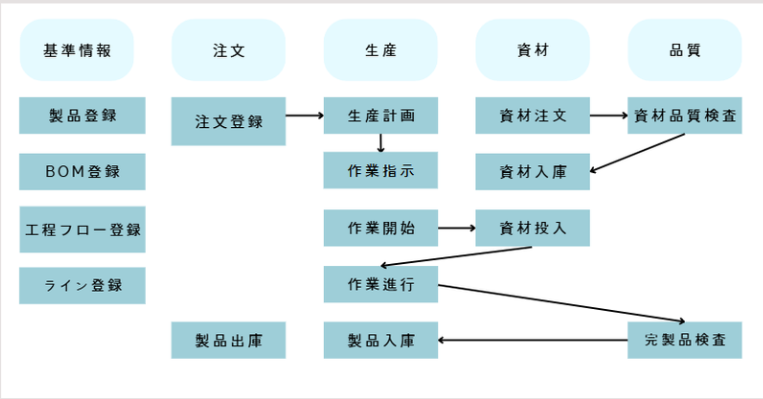

# MESラーメン工場サイト

## 📋 プロジェクト概要

- MESに関する工程と用語の理解。生産管理システムをデータ化することに関する実装中心のプロジェクトです。

- 要件定義、画面設計、ERD設計など、事前に作成された教育機関のドキュメントを参考にして

- 実際の画面と機能の実装のみを実践してみる学習プロジェクトです。

---

## 🛠️ 環境

| 区分 | 使用技術 |
|------|----------|
| IDE | Visual Studio Code |
| ソースコード管理 | GitHub |
| データベース | MariaDB |
| クラウドサーバー |  NAVER Cloud |
| フロントエンド | Vue.js, PrimeVue, HTML, CSS, JavaScript |
| バックエンド | Node.js, Express, JavaScript |

---

## 🗺️ サイト構成図

---

## 👥 チーム役割

> ※ 個人情報保護のため、一部メンバーはイニシャルで表記しています。

| メンバー | 担当内容 |
|----------|----------|
| **キム・ドンウ** | **基準情報（工程フロー、ライン）** |
| PH | 基準情報（BOM登録、製品登録） |
| KS | 注文（注文管理） |
| SC | 注文（製品入庫、出庫） |
| BJ | 生産（作業指示） |
| DU | 生産 （生産計画）|
| JJ | 資材 （資材管理、発注書管理）|
| PS | 資材 （入出庫管理）|
| SS | 品質 （品質指示管理）|
| KH | 品質 （品質結果管理）|

---

## 📁 担当機能のディレクトリ
[ディレクトリ構成を見る](MES_Project.txt)
